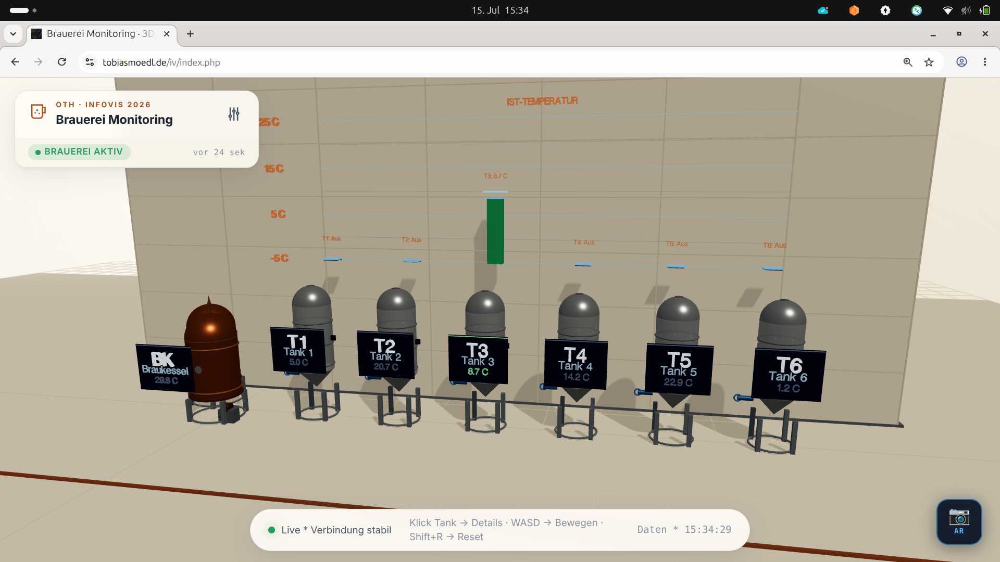
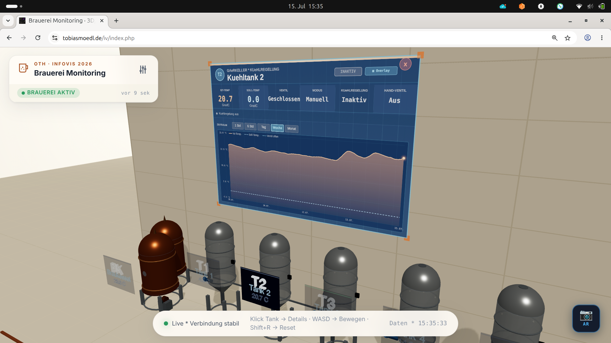
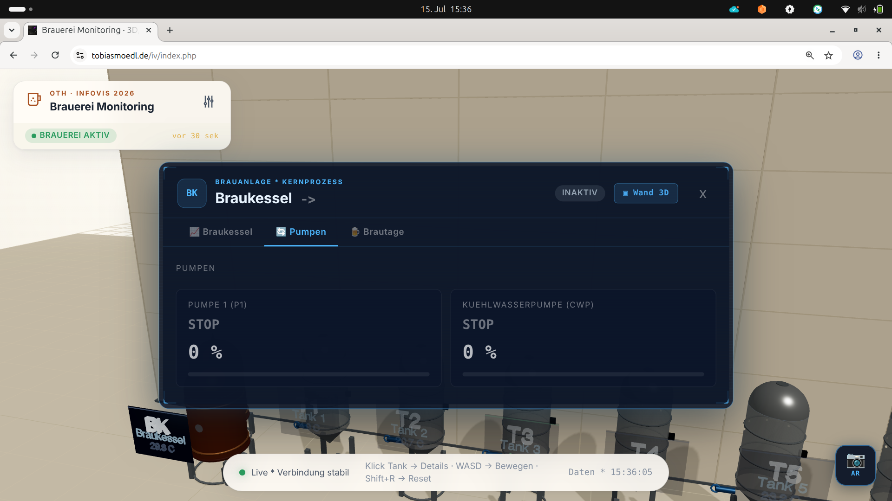
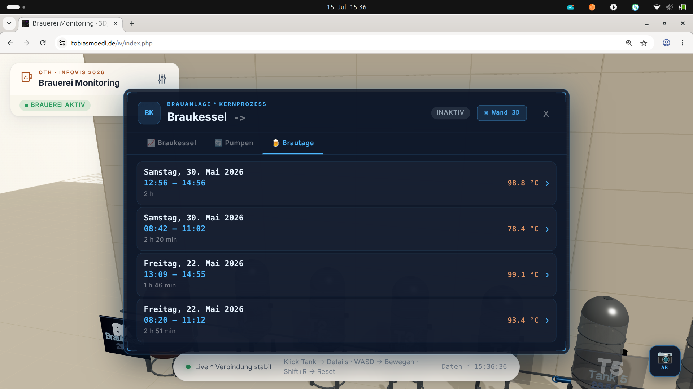
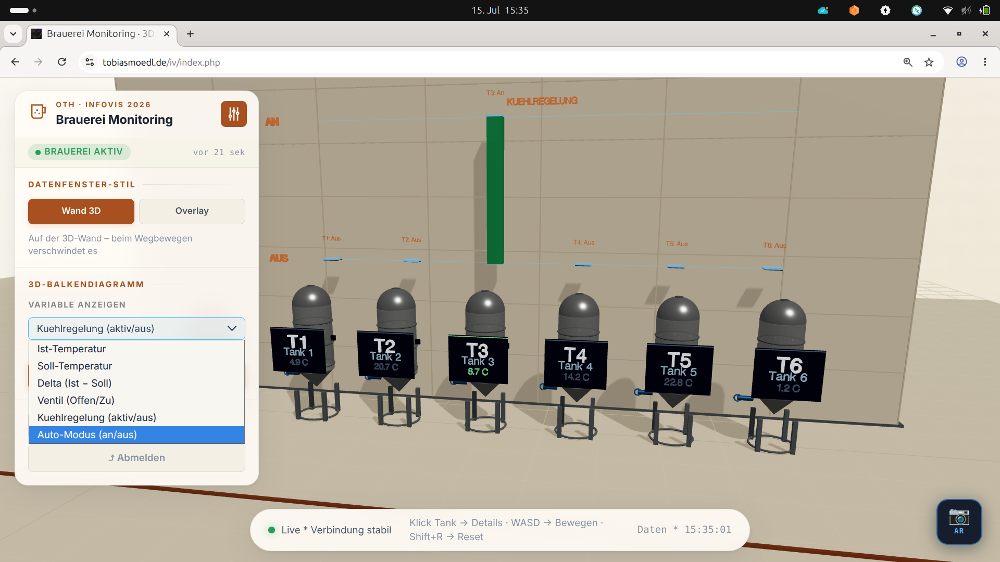
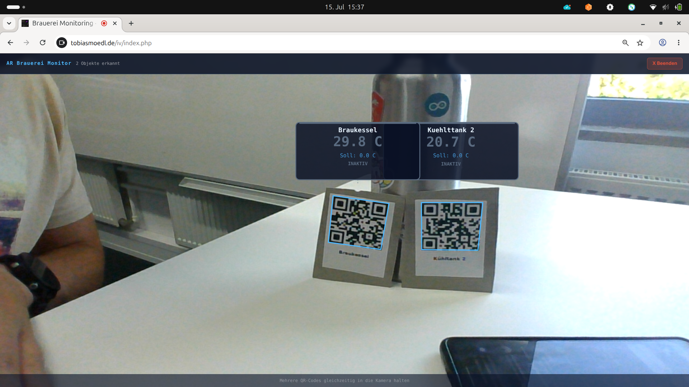

# Brauerei Monitoring 3D/AR

> Informationsvisualisierung Projekt 2026 · OTH Amberg-Weiden

Eine interaktive 3D-Visualisierung für eine echte Brauanlage (6 Kühltanks, 1 Braukessel, Pumpenkreis) mit Live-Daten aus einer MySQL-Datenbank, plus einem AR-Modus für die Diagnose direkt vor Ort per QR-Code.

## Live-Demo

**URL:** https://tobiasmoedl.de/iv/
**Passwort:** `IV2026`

Läuft in Chrome, Edge und Safari (WebGL 2, für AR zusätzlich WebXR). Für den AR-Modus am besten ein Handy mit Kamera verwenden, am Desktop gibt's da nicht viel zu sehen.

> **Deployment-Hinweis:** Die Webapp liegt im Unterordner [`app/`](app/), der Dokumenten-Root des Webservers muss also auf `iv/app` zeigen und nicht auf das Repo-Root selbst.



---

## 1) Welche Daten werden visualisiert – und woher kommen sie?

Die Anlage läuft mit einer Siemens-SPS, die im Normalbetrieb keine Daten nach außen schickt. Bevor an der eigentlichen Visualisierung überhaupt etwas gebaut werden konnte, musste also erstmal die Datenanbindung stehen: Ich habe eine kleine SPS-Funktion geschrieben, die alle 30 Sekunden die relevanten Prozesswerte ausliest und verschickt, dazu einen LTE-Router in der Brauerei installiert (dort gibt's kein brauchbares WLAN). Die Werte landen auf meinem eigenen Netcup-Server und werden dort automatisch in eine MySQL-Datenbank geschrieben – aus dieser Datenbank liest die Webseite dann live aus. Ohne diesen Umweg über SPS-Programmierung und Router-Setup gäbe es schlicht keine Live-Daten zum Visualisieren.

**Struktur in der Datenbank:** eine Tabelle pro Variable (`v_<VARIABLE>`), jeweils mit Spalten `ts` (Zeitstempel) und `val`. Das Frontend pollt alle 5 Sekunden.

Visualisiert wird pro Anlagenteil:

**Braukessel (BK)**
- `BK_Ist` – aktuelle Temperatur (°C)
- `BK_Soll` – Sollwert
- `BK_Ein` – Anlage aktiv (0/1)
- `BK_Auto` / `BK_Hand` – Betriebsmodus
- `BK_A_H` – Heizungs-/Ventilstatus

**Kühltanks 1–6 (T1…T6)**
- `Tx_IstT` – Ist-Temperatur
- `Tx_SollT` – Soll-Temperatur
- `Tx_Ein` – Kühlregelung aktiv
- `Tx_AM` – Auto-Modus
- `Tx_AV` – Automatikventil (offen/zu)
- `Tx_HV` – Handventil

**Pumpen & Kühlkreis**
- `P1_Run`, `P1_Val`, `CWP_Run`, `CWP_Val` – Pumpenzustände
- `T_HeatEx` – Kühlwasser-Temperatur am Wärmetauscher

Zusätzlich werden aus dem Verlauf automatisch **Brautage** erkannt: Sessions, in denen `BK_Ein > 0.5` ist, mit maximal 30 Minuten Lücke und mindestens 20 Minuten Dauer.

## 2) Warum gerade diese Daten?

Wer die Anlage betreut, will beim Draufschauen im Grunde vier Dinge sofort wissen:

1. **Läuft überhaupt gerade was?** – dafür der Aktiv-Status plus ein Sekundenzähler seit dem letzten Datenpunkt.
2. **Ist irgendwo ein Problem?** – Farbcodierung je nach Abweichung zwischen Ist und Soll.
3. **Wo genau?** – das 3D-Modell bildet die reale Aufstellung nach, man sieht sofort, welcher Tank gemeint ist, ohne erst eine Tank-Nummer nachschlagen zu müssen.
4. **Wie lief der letzte Brautag?** – als anklickbare Zeitreihe im Verlauf.

Eine klassische SCADA-Tabelle mit Zahlenkolonnen kann das auch alles anzeigen, aber man muss sie erst lesen und interpretieren. Die räumliche Darstellung spart genau diesen Schritt – man erkennt den kritischen Tank am Ort im Raum, nicht am Tabelleneintrag.

## 3) Wie sind die Daten gemappt?

Die 3D-Szene basiert auf Three.js (r158, WebGL):

| Datum | Visueller Kanal |
|---|---|
| Ist-Temperatur | Digital-Label über dem Tank + Höhe des 3D-Balkens |
| Soll-Temperatur | Horizontale Marker-Linie am Balken |
| Δ Ist–Soll (Status) | Farbe des Tanks: grün = ok, gelb = warn, rot = kritisch, grau = inaktiv |
| Ventilstellung | Animierter Fluss-Effekt am Rohr |
| Betriebsmodus (Auto/Hand) | Badge über dem Tank |
| Position im Raum | X-Koordinate entspricht der realen Aufstellung in der Brauerei |
| Auswahl-Variable | im Panel wählbar, welche Kennzahl gerade als 3D-Balken dargestellt wird |

Die Warn-Schwellen sind konfigurierbar und werden lokal in `localStorage` gespeichert – Tank: 2.0 °C Warnung / 5.0 °C kritisch (Bereich −2 bis 24 °C), Braukessel: 3.0 °C / 8.0 °C (Bereich 10 bis 105 °C).

Klickt man einen Tank an, fährt die Kamera zu einer virtuellen Wand hinter der Anlage, auf der die Zeitreihe als Liniendiagramm erscheint. Das lässt sich auch als klassisches HTML-Overlay umschalten, falls einem die 3D-Projektion zu verspielt ist.



Für Brautage werden zusätzlich `BK_Ist`, `BK_Soll`, `BK_A_H` und die Pumpendaten des gewählten Tages geladen, per SQL-Bucketing auf maximal 800 Punkte aggregiert.





## 4) Interaktion (Suche / Filter)

**Navigation:**
- Maus ziehen dreht die Kamera, Mausrad zoomt
- WASD bewegt die Kamera, Q/E für die Höhe, Shift+R setzt zurück
- Klick auf Tank oder Kessel öffnet die Detailansicht, Doppelklick auf leere Fläche geht zurück zur Übersicht

**Filter im Settings-Panel links:**
- Auswahl, welche Variable am 3D-Balkendiagramm angezeigt wird (sechs Optionen)
- Umschalten zwischen Wand-3D- und Overlay-Darstellung
- Warn-Schwellen für Tanks und Braukessel individuell einstellbar
- Liste erkannter Brausessions mit Datum, Dauer, Peak- und Durchschnittstemperatur



**Live-Feedback:** ein Verbindungs-Punkt in der Fußleiste zeigt den Zustand (ok/warn/kritisch), ein „vor X Sek"-Zähler die Datenaktualität – bleibt der länger als 120 Sekunden stehen, meldet die Anwendung „Brauerei offline". Der aktuelle Anlagenstatus (Aktiv/Inaktiv) ist immer sichtbar.

## 5) XR (Augmented Reality)

Über den 📷-Button unten rechts lässt sich ein AR-Modus starten (WebXR, `ARButton`). Man hält die Kamera auf die reale Anlage, die QR-Codes an Tanks und Kessel werden erkannt, und über jedem erkannten Objekt erscheint ein schwebendes Datenfenster mit Temperatur, Status und Modus. Das funktioniert auch mit mehreren Codes gleichzeitig im Bild.

QR-Codes kodieren einfach:

```
BRAUEREI:TANK:1
BRAUEREI:TANK:2
...
BRAUEREI:TANK:6
BRAUEREI:KESSEL:1
```

Der Gedanke dahinter: bei einem Rundgang durch die Brauerei will man nicht erst am Panel nach dem richtigen Tank suchen, sondern einfach das Handy draufhalten.



---

## 6) EEG-Auswertung – Interpretation der Test-Session

Als Teil der Studienarbeit wurde eine Testperson beim Betrachten des Brauprozess-Videos und der Visualisierung mit einem Zwei-Kanal-EEG aufgezeichnet (Frontal + Okzipital, biosignalsplux, 1000 Hz). Vollständiges Notebook inkl. Methodik: [`EEG/eeg_analysis_brewvis.ipynb`](EEG/eeg_analysis_brewvis.ipynb), der komplette PDF-Report liegt unter [`EEG/EEG_Report_BrewVis.pdf`](EEG/EEG_Report_BrewVis.pdf).

**Kurz zusammengefasst** (Aufnahme: 8,8 Minuten, davon war eines von zwei Videos EEG-seitig abgedeckt):

- Das Beta/Alpha-Verhältnis lag bei 1,75 – deutlich im aktivierten Bereich. Die Person war während der Session geistig grundsätzlich präsent, nicht eingenickt oder abgeschaltet.
- Zwischen Baseline und Video steigt der Alpha-Anteil frontal um 76 % an (statistisch signifikant, p < 0.001). Das ist erstmal kein gutes Zeichen: mehr Alpha bedeutet tendenziell weniger Fokus, nicht mehr. Die Visualisierung hat die Aufmerksamkeit beim Start des Videos also eher nicht zusätzlich gebunden.
- Der Aufmerksamkeits-Trend über die Videolänge fällt leicht ab (Steigung −0,099) – ein Hinweis auf nachlassendes Interesse oder Ermüdung gegen Ende, keine durchgehend steigende Spannungskurve.
- Die Kopplung zwischen frontaler und okzipitaler Beta-Aktivität ist mit r = −0,05 praktisch nicht vorhanden. Das heißt, visuelle Reize in der Darstellung haben die kognitive Aufmerksamkeit nicht erkennbar mitgezogen – Sehen und Fokussieren laufen in dieser Messung eher unabhängig voneinander.
- 9 einzelne auffällige EEG-Momente wurden automatisch erkannt, darunter 3 Theta-Bursts, die im Notebook als mögliche Überlastungsmomente interpretiert werden (zu viel Informationsdichte in dem Moment).
- Das im Notebook definierte Bewertungsschema kommt in Summe auf **53 von 100 Punkten** – eingestuft als „verbesserungswürdig", nicht als gescheitert, aber mit klarem Potenzial nach oben.

**Wichtige Einschränkung:** Das Ganze basiert auf einer einzigen Testperson mit zwei Elektroden. Für eine echte wissenschaftliche Aussage bräuchte es deutlich mehr Probanden und ein volles EEG-Setup – die hier gezeigten Werte sind explorativ und als Werkzeug zur Verbesserung der eigenen Visualisierung zu verstehen, nicht als belastbare Studie. Trotzdem geben sie konkrete Ansatzpunkte: weniger Informationsdichte an den Stellen mit Theta-Bursts, und eventuell mehr Interaktivität gleich zu Beginn des Videos, um die Aufmerksamkeit besser zu binden.

Rohdaten, Sync-Videos und alle Auswertungsskripte liegen unter [`EEG/`](EEG/), die generierten Grafiken/Reports unter [`EEG/output/`](EEG/output/).

---

## Projektstruktur

```
├── app/                     Webapp (Dokumenten-Root für den Web-Server)
│   ├── index.php            Haupt-Einstiegspunkt (nach Login)
│   ├── login.php / auth.php Session-basierte Anmeldung (bcrypt)
│   ├── config.example.php   Konfigurations-Vorlage (→ config.php kopieren)
│   ├── api/get_data.php     JSON-API: list | current | series | brew_days
│   └── assets/
│       ├── css/              Styles (Panel, Modal, Wall-Display)
│       └── js/
│           ├── main.js          App-Orchestrator, Polling-Loop
│           ├── Scene.js         Three.js-Szene + Kamera
│           ├── BreweryModel.js  3D-Modell der Anlage
│           ├── BarChart3D.js    Konfigurierbares Balkendiagramm
│           ├── Labels3D.js      Digitale Temperatur-Labels
│           ├── WallDisplay.js   HTML-Overlay-Detailfenster
│           ├── WallPanel3D.js   3D-Wand-Detailfenster
│           ├── SettingsPanel.js Linkes Bedien-Panel
│           ├── ARMode.js        WebXR + QR-Erkennung
│           ├── dataService.js   Fetch-/Polling-Layer
│           └── config.js        Frontend-Konstanten
├── EEG/                     Nutzertest-Auswertung (EEG, Studienarbeit)
│   ├── eeg_analysis_brewvis.ipynb  Auswertungs-Notebook
│   ├── EEG_Report_BrewVis.pdf      PDF-Report (Abgabe-Dokument)
│   ├── data/                       EEG-Rohdaten + Aufnahme-Videos
│   └── output/                     Generierte Grafiken/Overlay-Videos/Tabellen
├── Konzept/                 Konzept-Dokument der Studienarbeit (PDF)
└── docs/screenshots/        Screenshots für dieses README
```

## Lokale Installation

```bash
git clone https://github.com/tmoedl/iv.git
cd iv/app
cp config.example.php config.php
# DB-Zugang und Passwort in config.php eintragen
# Web-Server-Dokumenten-Root auf dieses Verzeichnis (iv/app) zeigen lassen (PHP 8+, MySQL 5.7+)
```

Beim ersten Login wird aus `DEFAULT_PASSWORD` automatisch ein bcrypt-Hash in `app/.pwhash` erzeugt.

Das Repo nutzt [Git LFS](https://git-lfs.com) für die großen Binärdateien (EEG-Videos, `.h5`-Rohdaten, PDF-Report) – vor dem Klonen einmal `git lfs install` ausführen, sonst bekommt man nur die Platzhalter-Zeiger statt der echten Dateien.

## Tech-Stack

- Backend: PHP 8, PDO/MySQL
- Frontend: Three.js r158 (WebGL 2), Vanilla JS (ES-Modules)
- XR: WebXR Device API (`ARButton`)
- Auth: Session + bcrypt, einfache Brute-Force-Bremse (8 Versuche / 5 Minuten)
- EEG-Auswertung: Python (NumPy/SciPy/Pandas), MNE-nahe Methoden, Matplotlib/Plotly, OpenCV für das Video-Overlay

## Autor

Tobias Mödl · OTH Amberg-Weiden · Informationsvisualisierung 2026
